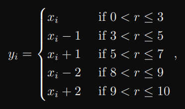

# **Lista 4**

## Questão 1

Escreva um programa que adicione dois números usando ponteiros. Além do valor da soma, imprima
também o endereço de memória onde o valor resultante dessa soma está armazenado.

## Questão 2

Escreva um programa que troque o valor de dois números utilizando ponteiros.

## Questão 3

Escreva um programa que solicite iterativamente um número do usuário e imprima sempre o menor
valor fornecido. Crie um critério para finalização do programa. Utilize ponteiros.

## Questão 4

Escreva um programa que leia um vetor do usuário e imprima seus valores e seus endereços. Teste
o vetor com tipos de dados diferentes, analise os endereços. O que você observou?

## Questão 5

Escreva um programa que encontre o tamanho de uma string fornecida. Utilize ponteiros.

## Questão 6

Escreva um programa que copie uma string para outra usando ponteiros.

## Questão 7

Escreva um programa que concatene duas strings utilizando ponteiros.

## Questão 8

Escreva um programa que busque um caracter fornecido em uma string utilizando ponteiros.

## Questão 9

Implemente o método de ordenação bolha utilizando ponteiros.

## Questão 10

Escreva um programa que gere um vetor X com números pseudoaleatórios no intervalo [0,N − 1].
Crie um vetor F com N posiç ̃oes e armazene em cada posição de F a quantidade de ocorrências
dos elementos de X. Exemplo:

Para N = 7, temos:

X = [4, 6, 2, 3, 2, 3, 0, 2, 5, 5, 2, 6, 0, 5]

Portanto,

F = [2, 0, 4, 2, 1, 3, 2]

Observe que as ocorrências dos elementos de X são armazenadas em F nos  ́ındices de mesmo valor.

## Questão 11

Escreva um programa que gere dois vetores (X e Y ) com números pseudoaleatórios no intervalo
[0,N − 1]. Crie uma matriz M com dimens ̃oes NxN que armazene as coocorrências dos elementos
de X e Y da seguinte forma:
Por exemplo, para N = 7:

X = [4, 6, 2, 3, 2, 3, 0, 2, 5, 5, 2, 6, 0, 5]

Y = [3, 6, 2, 1, 0, 2, 1, 3, 5, 5, 3, 4, 1, 5]

Portanto,

## Questão 12

Reimplemente a questão considerando que o vetor Y é dado em função de X da seguinte forma:

onde r é um número pseudoaleatório, xi e yi correspondem ao i-esimo elemento do vetor X e Y ,
respectivamente. Considere os valores limites definidos na questão anterior para yi, caso o valor obtido a partir de xi esteja fora da faixa.

## Observações

**Em todos os programas, utilizem #define para o tamanho do vetor.**
