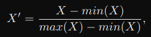
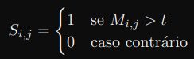
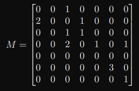

# Lista 5

## Questão 1

Escreva um programa que receba dois valores por linha de execução e realize a soma ou multi-
plicação, conforme um código de operação também recebido por linha de execução.

## Questão 2

Escreva um programa em C que informe o endereço do menor elemento de um vetor de inteiros
gerado. A quantidade de elementos desse array deve ser fornecido por linha de comando.

## Questão 3

Modifique a questão anterior criando uma função que armazena em um vetor os endereços do menor
e do maior elemento do vetor.

## Questão 4

Escreva um programa que dado um vetor X de inteiros, realize a seguinte normalização dos dados
(min-max):

onde min() e max() correspondem ao menor e maior do vetor, respectivamente.

## Questão 5

Escreva um programa que some todos os elementos de um vetor de float alocado dinamicamente.
A quantidade de elementos devem ser fornecidas por linha de comando. Utilize a função `rand()`
para alimentar o vetor com valores pseudo-aleatórios.

## Questão 6

Escreva um programa em C que apresente a média, a mediana e a moda de um vetor de inteiros
gerados aleatoriamente em tempo de execução.

## Questão 7

Calcule o erro médio quadrático entre dois vetores A e B de dimensão N gerados aleatoriamente.
Pesquise a equação.

## Questão 8

Escreva um programa em C que binarize os elementos da matriz M gerada aleatoriamente e com
dimensões obtidas em tempo de execução. A partir de um limiar t dado, crie a matriz S da seguinte
forma:

## Questão 9

Escreva um programa em C que informe se o somatório da diagonal principal de matriz N x N
gerada é par ou ímpar.

## Questão 10

Escreva um programa que gere dois vetores (X e Y ) com números pseudoaleatórios no intervalo
[0,N − 1]. Crie uma matriz M com dimensões NxN que armazene as coocorrências dos elementos
de X e Y da seguinte forma:
Por exemplo, para N = 7:

X = [4, 6, 2, 3, 2, 3, 0, 2, 5, 5, 2, 6, 0, 5]

Y = [3, 6, 2, 1, 0, 2, 1, 3, 5, 5, 3, 4, 1, 5]

Portanto,

**Use funções.**

## Observações

**Em todas as questões, utilize aritmética de ponteiros para referenciar os elementos da matriz (ou vetor).**
